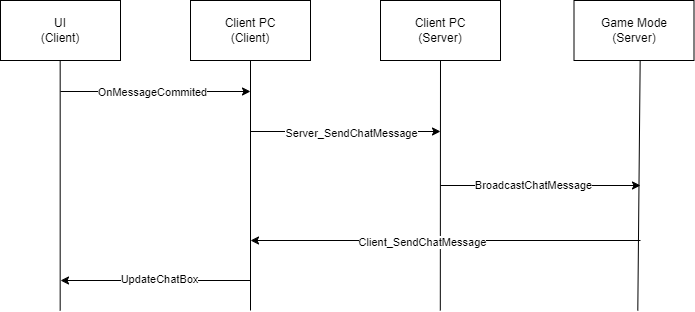

# Chat

## 구현 목표

각 플레이어가 채팅을 쳐서 서로 의사소통을 하는 기능을 구현한다.

## 구현 방법

- RPC를 통해서 동기화를 실행한다.
- RPC를 선택한 이유는 UI는 Replicate로 접근할 수 없어서 Game State로 Replicate를 하거나 Player Controller를 사용해야 한다.
- 채팅 문자열 자체는 동기화될 필요가 높지 않기 때문에 RPC를 통해서 구현하기로 결정했다.
  - 플레이어가 들어와 있지 않을 경우의 채팅은 기록되지 않아도 됨
  - 채팅의 순서는 중요하지 않음(경쟁적이지 않음)

### 도식화

## 작업 목록

- Mock UI 생성
- Player Controller 작성
- GameMode 작성
