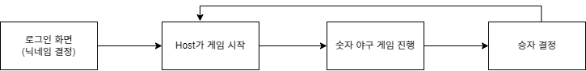

# Sparta_Practice_9

채팅 기능을 지원하고 사용자로부터 입력을 받아서 숫자 야구 게임을 할 수 있는 게임

## 게임 기능

- 사용자 입력으로부터 중복되지 않고 허용되는 형식의 아이디를 입력 받아서 설정하는 기능
- 사용자의 입력으로부터 채팅을 할 수 있는 기능
- 숫자 야구 게임을 할 수 있는 기능

## 게임의 흐름

## 게임 진행 방법

### 닉네임 설정 기능

- 닉네임 설정 조건
  - 중복되지 않음
  - 영문, 한글, -,_로만 이루어짐
  - 3-8글자

### 숫자 야구 게임

- Listen Server가 /start 명령어를 치면 게임이 진행
- 로그인 서버에 진행된 순서대로 /숫자 세 자리를 입력하면 숫자가 제출
  - 턴 유저가 아닌 유저가 숫자를 제출하면 무시
- 유저가 정답을 맞출 경우 게임 종료
- 최대 턴 수에 도달하게 될 경우 게임 종료
  - 모든 유저가 추측을 한 것이 1턴이 되며 3턴이 끝나게 되면 게임이 종료

## 구현한 도전 기능

- 턴 제어 기능

## 과제 기능 외 구현 기능

- 채팅 UI
- 게임 시작 기능
- 로그인 기능
  - 사용자로부터 입력을 받아서 닉네임 결정 기능
  - 닉네임 유효성 검사 기능
